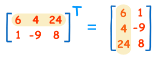

---
---
---

# Libraries

```{r message=FALSE, warning=FALSE, paged.print=FALSE}
library(bbmle)
library(tidyverse)
library(lme4)
library(plotly)
library(viridis)
library(cowplot)
library(data.table)
library(broom)
```

*"All models are wrong but some are useful" - George Box*

# Linear Regression

## Data Generation

```{r}
x <- rnorm(10)
y <- x * 3 + 5 + rnorm(10)
df = data.frame(y, x)
```

```{r}
ggplot(data = df, aes(x, y)) + 
  geom_point()+
  theme_classic()
```

The true beta for our function is 3 with an intercept of 5 and some noise added.

## Different Approaches

Models can be formulated and approached from many different angles while still arriving at the same conclusion. Oftentimes approaching these models in different ways can help us to foster complex connections. As such, before moving to mixed linear models, it will be helpful to do a brief overview of "regular" linear regression to foster the connection to mixed linear models.

When modeling we simply type a few commands into R and pray we get the output - or at least I do. Hence why I find it helpful to sometimes build everything from the ground up.

### Using R

I want to briefly show you the coefficients that R gives to prove the other methods arrive at the same answer.

```{r}
lin_reg <- lm(y ~ x, data = df)
print(lin_reg$coefficients)
```

### Closed Form Solution

The first formation we will examine will be the closed form of linear regression. The general form that we want to minimize is $Y = XB + e$

-   Y is m x 1

-   X is m x n

-   B is n x 1

-   e is some irreducible error

⭐^~A quick matrix multiplication refresher: the inner dimensions must match and they cancel out to give the outer ones, m X n \* n X 1 becomes m X 1~^ ⭐

Most linear equations of real world data is what "math people" would call inconsistent i.e. too many **Y's** and not enough **B's**. For example, consider $6 = 3b$ and $9 = 3b$. It is impossible to find a **B** that satisfies both equations, but we can come up with a best guess that minimizes that e. In this case it would be the average of the each of the best **b** or $2\frac{1}{2}$.

When we return to the original data generation, we have two parameters and 100 equations, so clearly no solution will fit. We will try to find, instead, that best guess of beta. If we go all the way back to middle school and the first time we learned algebra, we simply isolate the variable we want to find which leads to dividing both sides by X right....?

Except in linear algebra world there is no such thing as division instead it will be multiplying by the inverse. Ok, so lets just do that...\
Except you can't take the inverse of a matrix that is not square so we have to make **X** square. We can do this by multiplying both sides by $X^t$(the transpose) giving a square matrix.



Our new equation is $YX^t = (X^t X)B$ . Now since **B** is being multiplied by a square matrix we can invert the new square matrix. So we now have $YX^t(X^tX)^{-1} = (X^tX)(X^tX)^{-1} B$ . When we multiply a matrix by its inverse we get back the identity matrix (all ones) which cancels out just like in normal algebra. As such our new final equation is $B = YX^t(X^tX)^{-1}$.\
~~Proving that this gives the proper dimensions is left as an exercise for the reader~~

```{r}
X = cbind(rep(1, 10), x)
beta_cf = t(solve(t(X) %*% X) %*% t(X) %*% y)
print(beta_cf)
```

### Gradient Descent

So the next approach that is worth is gradient descent. Bear with me, I know this seems unconnected. I promise it'll tie together. First though, we must go back to the dreaded **derivative**.

Good news is I wont discuss the actual math but more a quick example.

```{r message=FALSE, warning=FALSE}
yards = seq(0,10,.5)
height = -(yards - 5) ** 2 + 25
speed = 2 * (yards - 5)
df = data.frame(yards, height)

p <- ggplot(df, aes(yards, height, color = -height)) +
    geom_point(aes(frame = speed), size = 6, show.legend = FALSE)+
    xlab("yards")+
    ylab("height")+
    scale_color_viridis()+
    theme_classic()

ggplotly(p)
```

So pretend you are standing on the 0 yard and you throw a pass to your friend on the 10th yard line. As the pass leaves your hand it goes up and as it goes up it will slowly lose speed until it reaches the top of the arc and gravity takes over and speeds up again. The derivative allows us to see when the maximum (or minimum) is reached because it will be when the rate of change (speed of the ball) reaches zero.

Obviously this isn't physics class so why do we care. Well... think about the shape of that throw. It's a parabola, the same shape as given by the loss function in OLS i.e. $(y - \hat{y})^2$ where $\hat{y} = mx+b$. If we compare to our previous example, the speed is equivalent to error which is adjusted by m and b. As we adjust m and b we can find where the speed(error) becomes zero thus giving us the highest point of our throw.

```{r}
# Random init. of params
beta_gd = t(matrix(runif(2,0,5)))
eta = .001
N = length(y)

for(i in 1:5000){
  #Gradient of 1/N*((Y-XB)^2) is 2/N (y - XB) * -X wrt B 
  grad = 2/N * (y - beta_gd %*% t(X)) %*% -X
  #Gradient Descent is beta_n :=  beta_n-1 - learning rate * gradient of MSE wrt B
  beta_gd = beta_gd - (eta * grad)
}

print(beta_gd)
```

Now for the final method and the one that is used in mixed linear modeling.

### Maximum Likelihood

If we recall back to probability, a point chosen from the normal distribution at random is not actually the probability of it occurring.

> ~Likelihood vs probability are a bit out of the scope of this workshop but if you are curious here is a great link [here](https://www.youtube.com/watch?v=pYxNSUDSFH4).~

The key idea behind Maximum Likelihood Estimate is to find the distribution that best describes our data. This is done by tuning the model parameters until the likelihood of each point being drawn from that distribution is maximized. For an easy visual example, consider fitting a normal distribution to the data points below.

```{r}
f <- 1:6
x <- seq(0, 10, length.out = 1000)
y <- unlist(lapply(f+1, dnorm, x = x))

DT <- CJ(f, x) # like expand.grid()
DT[, y := y]
DT[, step := paste0("step-", f)]

staticDT <- CJ(f, x = c(4.5,5,5.5), y = 0)
staticDT[, step := paste0("step-", f)]

fig <- plot_ly(
  data = DT,
  x = ~x,
  y = ~y,
  frame = ~step,
  type = 'scatter',
  mode = 'lines',
  showlegend = FALSE,
  color = I('#00CED1')
)

fig <- add_trace(
  fig,
  data = staticDT,
  x = ~x,
  y = ~y,
  frame = ~step,
  type = 'scatter',
  mode = 'markers',
  showlegend = FALSE,
  color = I('red'),
  inherit = FALSE
)

fig <- animation_opts(
  fig, transition = 0, redraw = FALSE
)

fig <- animation_slider(
  fig, currentvalue = list(prefix = "Frequency: ")
)

fig
```

The actual way this is done is as follows: Given N random normal variables the likelihood of the points being drawn from a distribution is the independent so its the product of all the points. We then apply a natural log transformation to the points so it becomes a sum thus easier to differentiate. After because of the natural log the $f(x) = \frac{1}{\sigma\sqrt{2\pi}} \exp\left( -\frac{1}{2}\left(\frac{x-\mu}{\sigma}\right)^{\!2}\,\right)$ part in the exponent drops out. We then take the derivative of all these sums so the only part we are left with is $(x - u) / \theta$ which we set equal to zero and solve. Generally solving this by hand is very difficult so instead we use gradient descent.

As it turns out, this is the way complex linear models are calculated in R. This might seem strange at first. The connection between fitting a distribution to a set of points and fitting a line seem distant. One way to see the connection is we are choosing weights for our slope that best maximize the chance the data was chosen from that distribution. So our normal distribution becomes $\frac{1}{\sigma\sqrt{2\pi}} \exp\left( -\frac{1}{2}\left(\frac{y-XB}{\sigma}\right)^{\!2}\,\right)$. We can think of this as trying to center our normal distribution on the data from the animation above.

This is what we are doing below. We are finding the beta's while holding the parameters of the distribution constant. This allows us to find the beta's that would best maximize our chances of being drawn from a normal distribution with mean 0 and standard deviation of one.

```{r}
LL <- function(beta_0, beta_1, mu, sigma){
  residuals = y - (x * beta_1 + beta_0)
  likeihood = dnorm(residuals, mean = mu, sd = sigma)
  return(-sum(log(likeihood)))
      }

fit <- mle2(LL, start = list(beta_0 = 5, beta_1 = 3), fixed = list(mu = 0, sigma = 1))
beta_ll <- coef(fit)[1:2]
print(beta_ll)
```

# Linear Mixed Models

## Examples of Usefulness

### Simpson's Paradox

The idea behind this "paradox" is when a set of data points that are positively correlated within group are combined resulting in a negative relationship.

Lets generate four plots

```{r}
x_1 <- seq(0,2,.1)
y_1 <- x_1 * 4 + 25 + rnorm(21)

x_2 <- seq(4.5,6.5,.1)
y_2 <- x_2 * 4 + rnorm(21)

x_3 <- seq(9,11,.1) 
y_3 <- x_3 * 4 - 20 + rnorm(21)

x_total <- c(x_1, x_2, x_3)
y_total <- c(y_1, y_2, y_3)

p1 <- ggplot(data = data.frame(x_1, y_1), aes(x_1, y_1))+
  geom_point()+
  geom_smooth(method = "lm", se = FALSE)+
  theme_classic()
  
p2 <- ggplot(data = data.frame(x_2, y_2), aes(x_2, y_2))+
  geom_point()+
  geom_smooth(method = "lm", se = FALSE) +
  theme_classic()
  

p3 <- ggplot(data = data.frame(x_3, y_3), aes(x_3, y_3))+
  geom_point()+
  geom_smooth(method = "lm", se = FALSE)+
  theme_classic()

p4 <- ggplot(data = data.frame(x_total, y_total), aes(x_total, y_total))+
  geom_point()+
  geom_smooth(method = "lm", se = FALSE)+
  theme_classic()

plot_grid(p1, p2, p3, p4)
```

If you notice individually each of the 3 plots have a positive relationship, but when we combine them we return a negative relationship. Obviously that might not be a big deal with 3 variables but what if we have 100? Suddenly checking each of them becomes much harder, or what if only certain combinations give rise to this paradox?

The first solution that comes to my mind would be to simply run the regressions individual like we did up top. There are two major problems. First you are throwing away data that could exist in global trends. Second this could lead to over fitting. Generally while not a problem with linear models it is still possible.

### Multicollinearity

Another big problem that occurs when running regular linear models is indefinite matricies. In plain English multicollinearity is when the independent variables are too correlated turning results meaningless.

If you think back to the closed form solution of linear regression the key step was being able to invert our matrix X. When the rows become highly correlated this inversion becomes very small. As such we cause our beta's to become very large. This tends to happen a lot with longitudinal data because as the number of rows becomes much larger than the independent examples multicollinearity is nearly guaranteed to happen.

## Handling these problems

### Theory

One way to handle weaknesses in linear regression is by using mixed effect models. First, let's discuss what is a mixed effect model. A mixed effect model is a model that allows you to describe both fixed and random effects. A fixed effect is when we create a non-random quantity, and a random effect is calculated as a random variable. The way this is modeled is quite straightforward actually!

If we recall the general linear model is $y = XB$. In this case, we are only modeling fixed effects. When modeling fixed effects, we assume that the response variable is constant across all observations and independent variables. However, in our case above, we see that there clearly is some change *within* observations.

As such, we would like to be able to explain that change (variance) as a random variable because they are not directly observed and thus cant be directly modeled. However, because we believe these groups are part of a larger picture we want to see how they change relative to the picture, but since we are interested in the general trend the group is treated as being drawn from a distribution.

The equation then becomes $y = XB + ZU$. In this case Z represents our grouping and u is the random effect. As such, Z will be a very large sparse binary matrix with dimensions N x C where C is the number of clusters we have. For example, if we have 300 people each with 40 different doctors and 20 features. Our X matrix will be 300 by 20, and we want to cluster by person, so Z would be 300 by 40 matrix.

In my opinion, the U matrix is the most complicated. We consider $u \sim N(0,G)$. The G matrix in this case will be the covariance - variance matrix of our random effect around $B$ . The easiest way to demonstrate this is with a random intercept. If we have our fixed effect as $y = x_1b_1 + b_0$ we need to calculate the variance of our within group $y_{group}$ around $b_0$ to find our random effect. Lets pretend we have only have two groups, A and B, with each group having two points. The random intercept for A would be found as calculating the variance for group A: $(b_0 - y_{a1})^2 + (b_0 - y_{a2})^2$. This value is then plugged for g in $u \sim N(0,g)$. After we calculate the random intercept for B in the same way.

### Code

Now I am assuming we are finally getting to the part that everyone cares about: how to code this stuff up. Please note the data here is completely made up but is formatted to be the same as a real data set.

```{r}
df <- read_csv("memory_data.csv")

key <- df %>% group_by(FID) %>% count() %>% filter(n == 10)

df <- df %>% filter(FID %in% key$FID) %>% na.omit()

df$highlight <- ifelse(df$FID %in% tail(unique(df$FID),5), "1", "0")
```


Lets get an idea for the amount of variation we are seeing in each FID when examining memory score over the time intervals. It does look while the scores bounce around there is some separation as the scores head down.

```{r echo=FALSE, warning=FALSE}
df %>% tail(500) %>% ggplot(aes(x = interval_MEM,  y = MEM))+
  geom_line(aes(group = FID, color = highlight))+
  scale_colour_manual(values = c("1" = "black", "0" = "grey"))+
  scale_y_continuous(limits = c(-2, 1.5), breaks = seq(-2, 1.5, 1))+
  theme(axis.line=element_blank(), legend.position="none",
  panel.background=element_rect(fill = "cornsilk1"),panel.border=element_blank(),panel.grid.major =element_blank(),
  panel.grid.minor=element_blank(),plot.background = element_rect(fill = "cornsilk1"))
```

Next lets see how good a regular regression fits - this makes it easier to compare when examining the mixed effects model.

```{r}
lin_reg <- lm(data = tail(df,500), formula = MEM ~ interval_MEM)

df  %>% tail(500) %>% ggplot(aes(x = interval_MEM,  y = MEM))+
  geom_line(aes(group = FID, color = highlight))+
  geom_abline(slope =lin_reg$coefficients[2], intercept = lin_reg$coefficients[1], color = "red")+
  scale_colour_manual(values = c("1" = "black", "0" = "grey"))+
  scale_y_continuous(limits = c(-2, 1.5), breaks = seq(-2, 1.5, 1))+
  theme(axis.line=element_blank(), legend.position="none",
  panel.background=element_rect(fill = "cornsilk1"),panel.border=element_blank(),panel.grid.major =element_blank(),
  panel.grid.minor=element_blank(),plot.background = element_rect(fill = "cornsilk1"))

lin_reg <- lm(data = df, formula = MEM ~ interval_MEM)
```

The summary statistics are as follows

```{r}
summary(lin_reg)
mean(lin_reg$residuals^2) # This is MSE and a personal favorite of mine
```

Overall the linear regression does not seem to do a terrible job. However, there are clearly parts the mode is missing. Lets see how a mixed effect model does using just a random intercept
```{r}
1.289/ (1.289 + 0.181)
```

```{r}
mem_ranint = lmer(data = df, formula = MEM ~ interval_MEM + (1 | FID ))
summary(mem_ranint)
```

The first thing that we notice is REML convergence; unless the model gives you a warning you can choose to ignore this value. Otherwise the model is saying that it wasn't able to find optimal value because of the random nature of the algorithm. The next thing that we see is the random effects group with FID intercept which tells us how much the new intercept varies from on average from the fixed intercept. This combined with the residual variance gives us how much variance in cluster is explained by the random effect which in this case is $ 1.29 \div (1.29 + .18) \approx 88%$. This means 88% of the variance within the grouping of FID can be explained using random intercepts alone. Lastly, we notice what the fixed effects. Given that our data is about balanced we see the the values are nearly the same as just the regular linear model. This is what we should expect and might suggest issues with the model choice otherwise.

If we are curious as to what the actual values are the lme4 package provides an function to view the values.

```{r}
ranef(mem_ranint)$FID %>% head(5)
```

If you are curious how these points are found maximum likelihood is used. As such, the initial guess can matter a lot because of the random nature of gradient descent. Often times you will run into the error the matrix is singular meaning the matrix could not be inverted. If you stumble across the error simply change the initial guess.

Obviously being able to pick up 88% of additional variance is quite nice. However, we can go even further. Next lets add a random slope.

```{r}
mem_ranslope = lmer(data = df, formula = MEM ~ interval_MEM + (1 + interval_MEM | FID))
summary(mem_ranslope)
```

The random slope effect might seem small. However, it should be interpreted in terms of the fixed slope of -.043; at a group level we are at a standard deviation of .077. This might not seem like a lot, but it means the slope is bouncing a ton comparatively. This also shows why we are not gaining much in the way of variance by adding a slope term for interval_MEM it does not help to account for the error.\

To say this a bit more formally - the random effect terms are shrunk towards the corresponding fixed effects term. As such, if the amount of variance explained by the random effect is small compared to the residual variance, the overall random effect shrinks towards the mean of the parameter.

```{r}
lmm <- ranef(mem_ranslope)$FID %>% 
  rename(slope = interval_MEM, intercept = `(Intercept)`)

lin_reg_indiv <- df %>% 
  nest_by(FID) %>%
  mutate(mod = list(lm(MEM ~ interval_MEM , data = data))) %>% 
  summarize(tidy(mod)) %>% 
  filter(term == "interval_MEM" || term == "(Intercept)") %>%
  ungroup()

p1 <- lin_reg_indiv %>% 
  filter(term == "interval_MEM") %>% 
  select(estimate) %>% 
  ggplot()+
  geom_density(aes(x = estimate, fill = "Regression"), alpha = .4)+
  geom_density(data = lmm, aes(x = slope, fill = "LMM"), alpha = .4)+
  scale_fill_manual(name = "groups", values = c(LMM = "orange", Regression = "blue"))+
  labs(title = "Slope Comparison") +
  theme_classic()
  
p2 <- lin_reg_indiv %>% 
  filter(term == "(Intercept)") %>% 
  select(estimate) %>% 
  ggplot()+
  geom_density(aes(x = estimate), fill = "blue", alpha = .4)+
  geom_density(data = lmm, aes(x = intercept), fill = "orange", alpha = .4)+
  labs(title = "Intercept Comparison") + 
  theme_classic()

legend <- get_legend(p1)

plot_grid(p2, p1)
```

It is worth noting here that we see different more varied means in the intercept term. This is exactly due to what is mentioned above i.e. a more shifted distribution with a larger variance helps to explain the data better.

## Limitations

### P Values

The first limitation I would like to mention is one that you might have noticed is missing - any mention of p-values. Constructing p-values from LMM is very hard. To quote the creator of the package of lme4

> "*There are several reasons for this, namely that with mixed models we are essentially dealing with different sample sizes, the N within clusters, which may vary from cluster to cluster (and even be a single observation!), and N total observations, which puts us in kind of a fuzzy situation with regard to reference distributions, denominator degrees of freedom, and how to approximate a 'best' solution. Other programs provide p-values automatically as if there is no issue, and without telling you which approach they use to calculate them (there are several). Furthermore, those approximations may be very poor in some scenarios, or make assumptions that may not be appropriate for the situation."*

Ultimately the basics end up being the same - low good high bad. I personally am hesitant with p-values due to the interpretation and ease of misunderstanding and as such do not feel comfortable discussing fuzzy p-values in this setting. It is out of scope of this presentation.

### Normality Assumption

The next major limitation is that we assume everything is normally distributed. If you recall the formula $Y = XB + ZU$ and recall that MLE is used which assumes a normal distribution we can rewrite this as $Y \sim N(XB, 0) + ZU$ where $U \sim N(0, G)$. As such everything is a combination of a normal distribution which means the Y is normally distributed when conditioned on these variables. I your Y is not normally distributed a generalized linear mixed model must be used or the data needs to be transformed to be normal which is generally not recommended. For more information please see [this link](https://ase.tufts.edu/bugs/guide/assets/mixed_model_guide.html).

### Small Numbers of Clusters

This discussion like any other in statistics balances on a knifes edge and just like any other model or statistical analysis more data is better for statistical power. If the number of data points in the model is too low then the interpretation obviously becomes misguided. However, there is no minimum sample required; in other words a cluster of one could be correct. It is important to make sure the results and methodology make sense.

# Resources

-   <https://stats.oarc.ucla.edu/other/mult-pkg/introduction-to-linear-mixed-models/>

-   <https://www.youtube.com/watch?v=XepXtl9YKwc>

-   <https://towardsdatascience.com/how-linear-mixed-model-works-350950a82911>

-   <https://m-clark.github.io/mixed-models-with-R/random_intercepts.html>

-   <https://en.wikipedia.org/wiki/Mixed_model>

-   <https://towardsdatascience.com/linear-mixed-model-from-scratch-f29b2e45f0a4>

-   <https://ase.tufts.edu/bugs/guide/assets/mixed_model_guide.html>

-   <https://www.stat.cmu.edu/~hseltman/309/Book/chapter15.pdf>

-   <https://cran.r-project.org/web/packages/lme4/vignettes/lmer.pdf>

-   <https://stats.oarc.ucla.edu/r/dae/mixed-effects-logistic-regression/>

-   <http://www.stat.rutgers.edu/home/yhung/Stat586/Mixed%20model/appendix-mixed-models.pdf>
